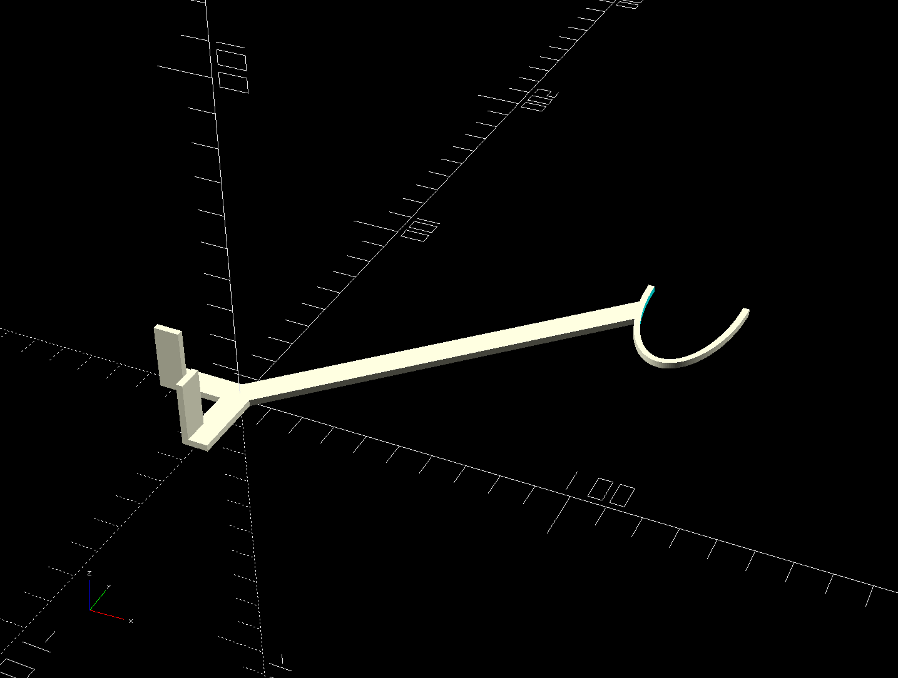

# A Jig for Hanging Curtain Rods

## Examples

### Oval Shaped Hangers



```openscad
windowsill_offset = 101.6; // 4"
hanger_width = 28.2;
hanger_height = 70.5;

curtain_oval_holder(
  windowsill_offset,
  windowsill_offset,
  hanger_width,
  hanger_height);
```
